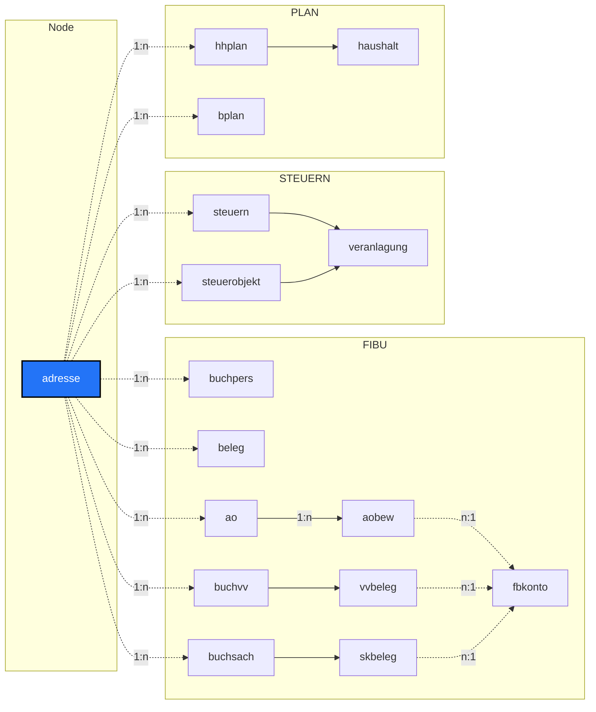
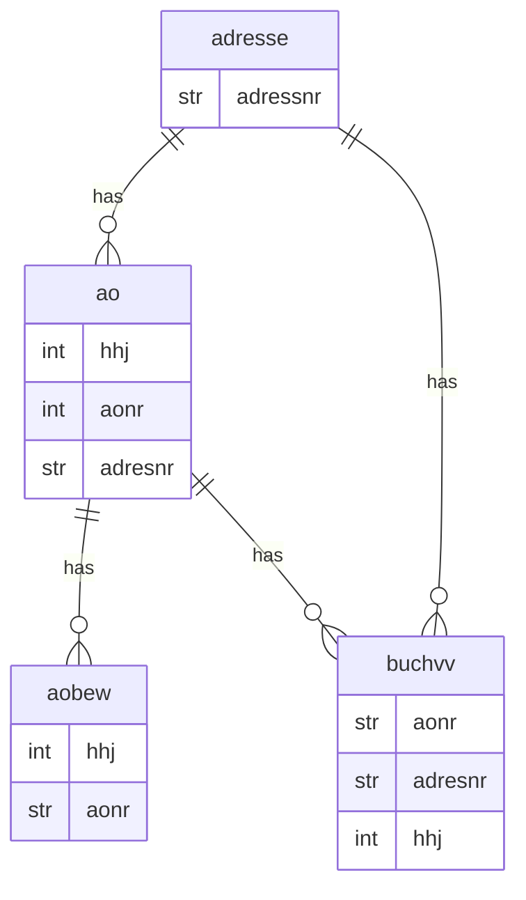
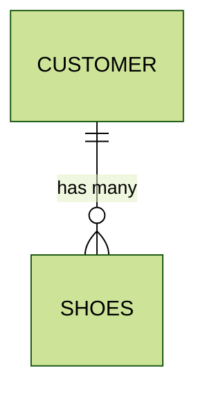

```mermaid
    flowchart LR
    classDef blue fill:#2374f7,stroke:#000,stroke-width:2px,color:#fff

    subgraph Node
        adresse:::blue
        end
    subgraph FIBU
        buchpers 
        beleg 
        ao --1:n--> aobew 
        buchsach --> skbeleg
        buchvv --> vvbeleg
        aobew & vvbeleg & skbeleg -.-> |n:1| fbkonto
        end
    subgraph STEUERN
        steuern & steuerobjekt --> veranlagung
        end
    subgraph PLAN
        hhplan-->haushalt  
        bplan      
        end

adresse -.-> |1:n| buchpers & beleg & ao & buchvv & buchsach & hhplan & bplan & steuern & steuerobjekt

```

```mermaid
    erDiagram

        adresse {
            str adressnr            
        }
        ao {
            int hhj 
            int aonr 
            str adresnr
        }
        aobew {
            int hhj
            str aonr
        }
        buchvv {
            str aonr
            str adresnr
            int hhj
        }

        adresse ||--o{ ao : has
        adresse ||--o{ buchvv : has
        ao ||--o{ aobew : has
        ao ||--o{ buchvv : has


```

```mermaid
%%{init: {"theme": "forest", "themeCSS": ["[id*=entity-SHOES] .er.entityBox { fill: orange;}"]}}%%

erDiagram
  CUSTOMER ||--o{ SHOES : "has many"
```