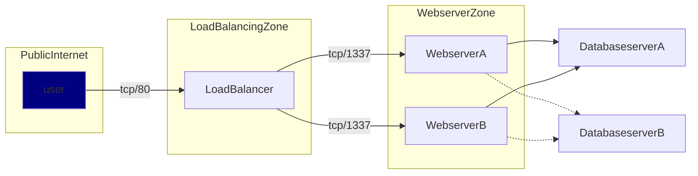
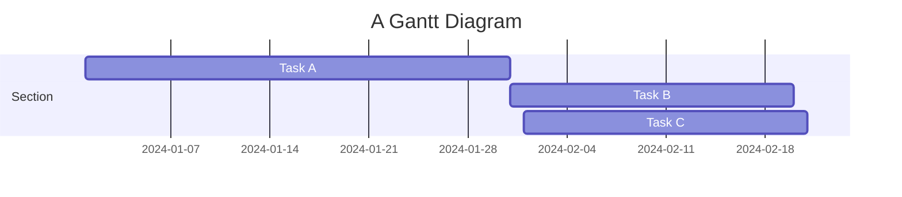
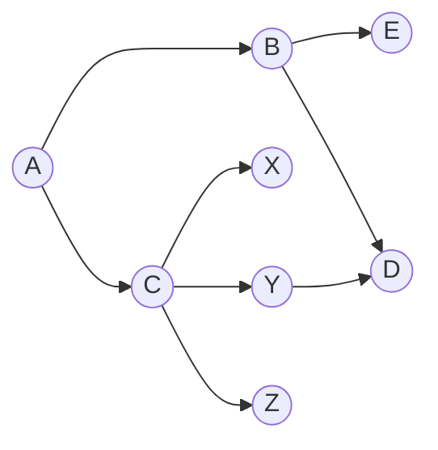
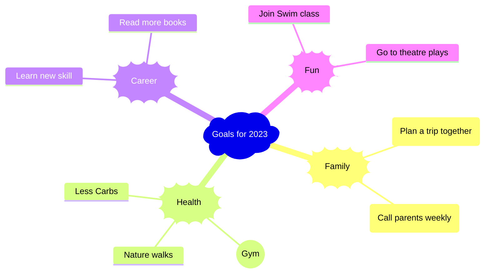
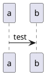

# DDD 

```mermaid
    flowchart LR
        subgraph PublicInternet
            user 
        end
        subgraph LoadBalancingZone
            LoadBalancer
        end
        subgraph WebserverZone
            WebserverA
            WebserverB
        end    

        user --tcp/80--> LoadBalancer
        LoadBalancer --tcp/1337--> WebserverA
        LoadBalancer --tcp/1337--> WebserverB

        WebserverA --> DatabaseserverA
        WebserverA -.-> DatabaseserverB
        WebserverB --> DatabaseserverA
        WebserverB -.-> DatabaseserverB

        style user fill:navy
```

# Test

```mermaid
    flowchart TB
        subgraph My App
            Home(((Home)))==>Review([Review])
            Home --> Edit([Edit])
            Home --> Help[[Help]]
            Edit-->Submit[(Database)]
            Submit-->Review

            style Home fill:navy
            style Review fill:darkgreen
            style Help fill: purple
            style Submit fill:darkred
        end
        
```

```mermaid
gantt
    title A Gantt Diagram
    dateFormat  YYYY-MM-DD
    section Section
    Task A       :a1, 2024-01-01, 30d
    Task B       :after a1  , 20d
    Task C       : 2024-02-01  , 20d
```

# Graph

```mermaid
graph LR;
    A((A)) --> B((B)) & C((C));
    B--> E((E)) & D((D)) 
    C--> X((X)) & Y((Y)) & Z((Z))
    Y-->D
```

# Mindmap

```mermaid
    mindmap
    )Goals for 2023(
        ))Family((
            (Plan a trip together)
            (Call parents weekly)
        ))Health((
            Less Carbs
            ((Gym))
            Nature walks
        ))Career((
            Learn new skill
            Read more books
        ))Fun((
            Join Swim class
            Go to theatre plays
```

```plantuml
    @startuml
    a->b : test
    @enduml
        
```