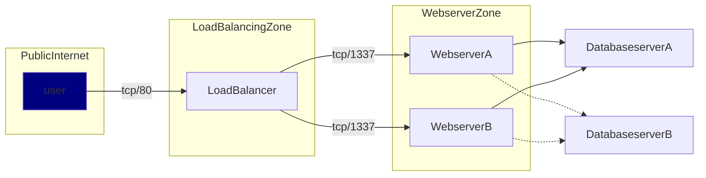

```mermaid
    flowchart LR
        subgraph PublicInternet
            user 
        end
        subgraph LoadBalancingZone
            LoadBalancer
        end
        subgraph WebserverZone
            WebserverA
            WebserverB
        end    

        user --tcp/80--> LoadBalancer
        LoadBalancer --tcp/1337--> WebserverA
        LoadBalancer --tcp/1337--> WebserverB

        WebserverA --> DatabaseserverA
        WebserverA -.-> DatabaseserverB
        WebserverB --> DatabaseserverA
        WebserverB -.-> DatabaseserverB

        style user fill:navy
```

```mermaid
    flowchart TB
        subgraph My App
            Home(((Home)))==>Review([Review])
            Home-->Edit([Edit])
            Home-->Help[[Help]]
            Edit-->Submit[(Database)]
            Submit-->Review

            style Home fill:navy
            style Review fill:darkgreen
            style Help fill: purple
            style Submit fill:darkred
        end
        
```